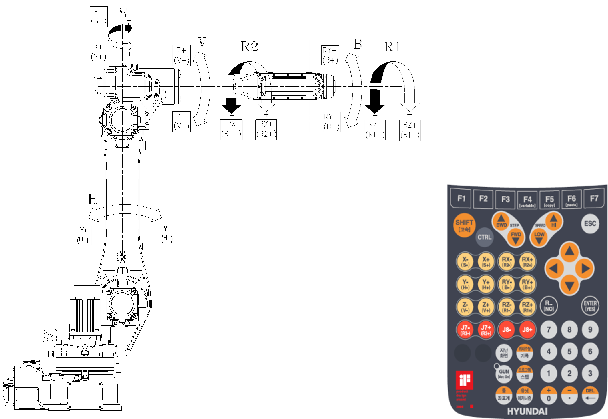

# 2.5. Axis Identification

<table class="tg">
<caption>Table 2-2 Axis Motion</caption>  
<thead>
  <tr>
    <th class="tg-bgl2">Axis Name</th>
    <th class="tg-bgl2">Operation</th>
    <th class="tg-bgl2" colspan="2">Teach Pendant Button</th>
  </tr>
</thead>
<tbody>
  <tr>
    <td class="tg-jnja">S</td>
    <td class="tg-baqh">Arm Swivel</td>
    <td class="tg-baqh">X+(S+)</td>
    <td class="tg-baqh">X-(S-)</td>
  </tr>
  <tr>
    <td class="tg-jnja">H</td>
    <td class="tg-baqh">Arm Forward and Backward</td>
    <td class="tg-baqh">Y+(H+)</td>
    <td class="tg-baqh">Y-(H-)</td>
  </tr>
  <tr>
    <td class="tg-jnja">V</td>
    <td class="tg-baqh">Arm Upward and Downward</td>
    <td class="tg-baqh">Z+(V+)</td>
    <td class="tg-baqh">Z-(V-)</td>
  </tr>
  <tr>
    <td class="tg-jnja">R2</td>
    <td class="tg-baqh">Wrist Rotation 2</td>
    <td class="tg-baqh">RX+(R2+)</td>
    <td class="tg-baqh">RX-(R2-)</td>
  </tr>
  <tr>
    <td class="tg-jnja">B</td>
    <td class="tg-baqh">Bending</td>
    <td class="tg-baqh">RY+(B+)</td>
    <td class="tg-baqh">RY-(B-)</td>
  </tr>
  <tr>
    <td class="tg-jnja">R1</td>
    <td class="tg-baqh">Wrist Rotation 1</td>
    <td class="tg-baqh">RZ+(R1+)</td>
    <td class="tg-baqh">RZ-(R1-)</td>
  </tr>
</tbody>
</table>
  

Figure 2.5 Robot Dimension and Axis
