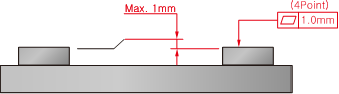

# 3.5.4. Accuracy of Installation Surface

The flatness of the four installation surfaces on the plate attachment surface of the manipulator and their height errors should satisfy the designated specifications. Shims should be used when necessary.

*	Cautions

    ①	The flatness of the 4 mounting plates must be within 1.0 mm.

    ②	The error in the heights of the four plate attachment surfaces should be within 1.0mm.(±0.5mm)

Figure 3.6 Robot installation surface accuracy