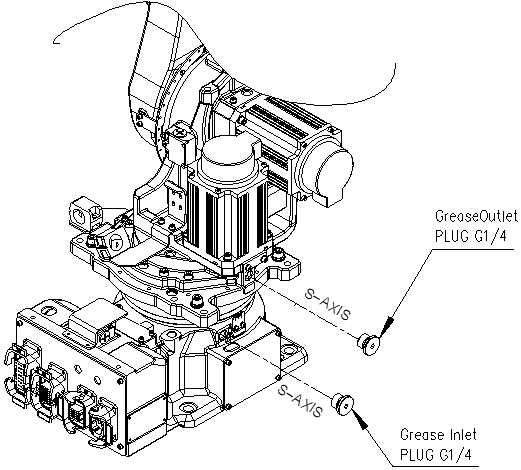

# 5.1.1. S-Axis Reducer

Figure 5.1 S-axis reducer

<blockquote>
<table border="0">
<thead>
  <tr>
    <td>
    

      
    

    </td>
    <td colspan="4">If grease is added without removing the outlet plug, the grease will go inside the motor and may damage it. It is absolutely necessary to remove the plug.</td>
  </tr>
</thead>
</table>  
</blockquote>

 

■	Grease Replacement

<ol style="list-style-type:decimal" start="1">
    <li>
Remove the grease outlet plug.
</li> 
    <li>
Inject the grease into the grease inlet using a grease gun.

-	Type of grease : VIGO GREASE RE0
-	Amount of grease : 755cc(680g)

 

-	Type of grease : RV GREASE LB00
-	Amount of grease : 755cc(657g)
                                                            
</li> 
    <li>
새 그리스가 배출구로 나올 때까지 주입하여 주십시오. 새 그리스의 확인은 색깔로 구분할 수 있습니다.
</li> 
    <li>
The grease replacement is complete when new grease appears in the outlet port. The new grease can be distinguished from the old one by color.
</li> 
    <li>Clean the outlet with cloth and release over-injected grease.

①	Place a vinyl bag on the grease outlet.

②	Commission the Axis-S at ±45° for 1.5 hours at 50% speed.

③	Remove the vinyl bag.
</li> 
    <li>Clean the greased around the outlet and assemble the seal-taped plug into its original state.
</li>
</ol>

 

<blockquote>
<table border="0">
<thead>
  <tr>
    <td>
    

      
    

    </td>
    <td colspan="4">If the specification of the currently filled grease is MOLYWHITE RE00, you must fill the VIGO GREASE RE0 grease after more than 100 hours of operation.</td>
  </tr>
</thead>
</table>  
</blockquote>

 

■	Injecting grease after replacing the reducer.
<ol style="list-style-type:decimal" start="1">
    <li>
Prepare a grease nipple A-PT1/4.
</li> 
    <li>Remove the plug G1/4 of the grease inlet, and fasten the grease nipple A-PT1/4.
</li> 
    <li>Remove the plug G1/4 of the grease outlet and an air vent set. 
</li> 
    <li>Inject the grease into the grease inlet using a grease gun.

-	Type of grease : VIGO GREASE RE0
-	Amount of grease : : 944cc(850g)
 

-	Type of grease : RV GREASE LB00
-	Amount of grease : 944cc(821g)
</li> 
    <li>The grease replacement is complete when new grease appears in the outlet port. 
</li> 
    <li>Discharge excessively fueled grease and residual pressure. (Refer to the discharge procedure below.)
</li> 
    <li>Remove the grease nipple of the inlet and the plug of the air vent, and assemble the inlet plug and air vent set.
</li>
</ol>

 

■	Procedure in discharging excessively fueled grease and residual pressure after grease replacement and injection
<ol style="list-style-type:decimal" start="1">
    <li>Attach a grease receiver or a hose to the grease outlet to prevent contamination from discharged grease.
</li> 
    <li>Operate it within a range without surrounding and interference under the following conditions.

①	Operation angle : 80°or more 

②	Operation speed : 50%

③	Operation time : 1.5 hours or more

④	Work so that the injected amount and the discharged amount are the same. If the discharged amount is less, the residual amount needs to be discharged through the inlet.
</li> 
    <li>Wipe the outlet port with a cloth and attach the plug.
</li>
</ol>
 
