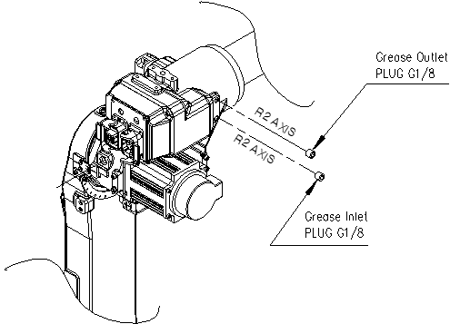

# 5.1.3. R2- Axis Reducer

Figure 5.3 R2-axis reducer

 

*	Grease Replenishment
<ol style="list-style-type:decimal" start="1">
    <li>
    Remove the grease outlet plug.
    </li> 
    <li>
    Inject the grease into the grease inlet using a grease gun.

-	Type of grease  : GADUS S2 V46 2
-  	Amount of grease  : 3cc
</li> 
    <li>
    Reassemble the seal-taped plug into its original state.
</li>
</ol>
 
